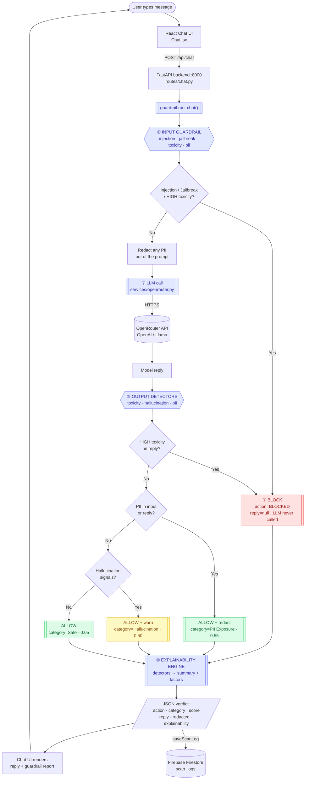
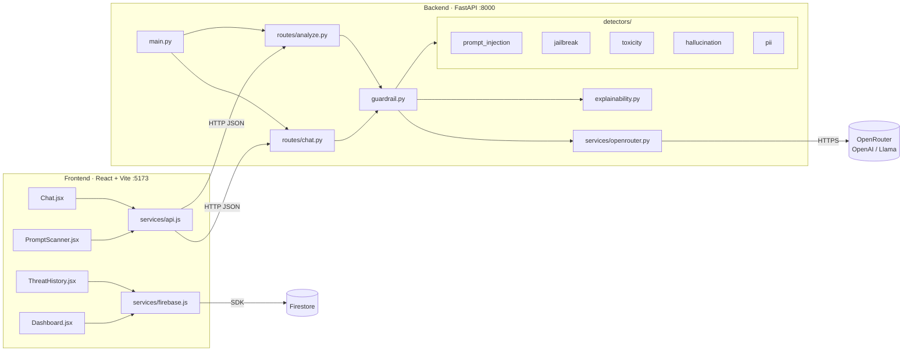

# Architecture

End-to-end design of the AI Safety Guardrail. The Chat page runs the full
pipeline: **input guardrail → LLM (OpenRouter) → output detectors →
Explainability Engine → ALLOW / BLOCK**.

## Pipeline flowchart

## Component layers

## Decision policy (highest risk wins)

| Trigger                                   | Action  | Category           | Score |
| ----------------------------------------- | ------- | ------------------ | ----- |
| Prompt injection                          | BLOCKED | Prompt Injection   | 0.94  |
| Jailbreak                                 | BLOCKED | Jailbreak          | 0.90  |
| Toxicity (HIGH: threat / hate / self-harm)| BLOCKED | Toxicity           | 0.88  |
| PII in prompt or reply                    | ALLOWED | PII Exposure       | 0.55  |
| Hallucination signals                     | ALLOWED | Hallucination Risk | 0.50  |
| Nothing                                   | ALLOWED | Safe               | 0.05  |

## How each detector scores

- **Prompt injection / Jailbreak** — regex patterns for instruction-override and
  known jailbreak personas; word boundaries prevent false positives (e.g. `\bdan\b`).
- **Toxicity** — lexicon across 4 buckets (self-harm / threat / hate = HIGH,
  profanity = MEDIUM); overall severity = the highest bucket that matched.
- **Hallucination Risk** — heuristic linguistic signals (unsourced authority,
  fabricated citations, overconfidence); ≥2 signal types = MEDIUM. Warns, never blocks.
- **PII** — regex for email / phone / PAN / Aadhaar / credit card; cards are
  Luhn-validated; `redact_pii()` swaps matches for `[EMAIL]`, `[CARD]`, etc.

> The scores are **fixed per-category severities**, not model probabilities — the
> detectors are deterministic rules, chosen for speed and explainability.

## Key design decisions

1. **Input screening before the LLM** — attacks are blocked at the door; no LLM
   cost is paid on a prompt-injection attempt.
2. **PII redacted before the LLM call** — user PII never crosses the third-party
   API boundary.
3. **Output re-screened** — the model's own reply is checked for toxicity,
   hallucination, and PII leaks.
4. **LLM is server-side & pluggable** — the OpenRouter key stays in `backend/.env`;
   any model slug works via `OPENROUTER_MODEL`.
5. **Graceful degradation** — if the LLM is down / unconfigured, detectors still
   run and a `note` explains the missing reply instead of erroring.
6. **Explainable by construction** — every verdict ships with per-detector factors.
