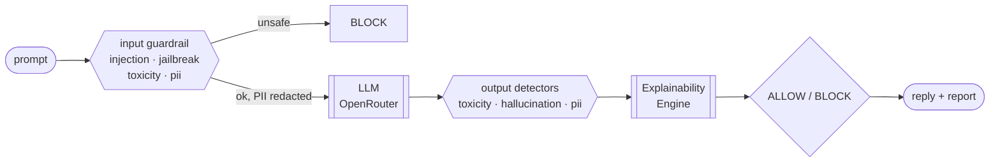

# AI Safety Guardrail

A full-stack AI Safety Guardrail system. A React frontend screens user prompts
and model responses for unsafe content via a Python **FastAPI** backend and
stores every result in **Firebase Firestore**.

> This repo contains **both** the React frontend (this folder) and the FastAPI
> backend (in [`backend/`](backend/), see [backend/README.md](backend/README.md)).
> Full design + diagrams: **[ARCHITECTURE.md](ARCHITECTURE.md)**.

## Pipeline at a glance



## Run the whole thing

```bash
# 1. Backend (terminal 1)
cd backend
python -m venv .venv && .venv\Scripts\activate   # macOS/Linux: source .venv/bin/activate
pip install -r requirements.txt
uvicorn main:app --reload --port 8000

# 2. Frontend (terminal 2)
npm install
cp .env.example .env
npm run dev
```

Open http://localhost:5173 — the backend runs on http://localhost:8000.

## Stack

- **React 18** + **Vite** (functional components & hooks)
- **react-router-dom** for navigation
- **Tailwind CSS** (dark navy/slate theme)
- **Recharts** for the threat-breakdown chart
- **lucide-react** for icons
- **axios** for API calls
- **firebase** (Firestore) for persistence

## Screens

| Route        | Screen          | What it does |
|--------------|-----------------|--------------|
| `/`          | Chat            | Chatbot landing page — every message is screened by the guardrail before it would reach a model |
| `/dashboard` | Dashboard       | Summary cards, recent activity feed, threat-category pie chart |
| `/scanner`   | Prompt Scanner  | Submit text to `/api/analyze`, view safety score / category / action / explanation / redacted text |
| `/history`   | Threat History  | Firestore-backed table with category + date-range filters; click a row for full detail |

## Environment variables

**Frontend** — set in `.env` (see [.env.example](.env.example)):

- `VITE_API_BASE_URL` — base URL of the FastAPI backend (e.g. `http://localhost:8000`)
- `VITE_FIREBASE_*` — your Firebase web app config

> If the Firebase vars are missing the app still runs — scans work against the
> API but aren't persisted and History stays empty.

**Backend** — set in `backend/.env` (see [backend/.env.example](backend/.env.example)):

- `OPENROUTER_API_KEY` — your key from https://openrouter.ai/keys (server-side only)
- `OPENROUTER_MODEL` — any model slug, e.g. `openai/gpt-4o-mini`

> Without an OpenRouter key the guardrail still runs (input/output screening +
> detectors); chat replies just come back empty with an explanatory note.

## Architecture

Full diagrams, decision policy, and per-detector scoring are in
**[ARCHITECTURE.md](ARCHITECTURE.md)**. In short:

```
prompt -> input guardrail (injection / jailbreak / toxicity / pii)
       -> LLM (OpenAI / Llama via OpenRouter)   [PII redacted before this call]
       -> output detectors (Hallucination / Toxicity / PII Leak)
       -> Explainability Engine -> ALLOW / BLOCK -> UI
```

The LLM is called server-side via **OpenRouter** — the key never touches the browser.

## API contract

`POST {VITE_API_BASE_URL}/api/chat` — full pipeline (Chat page)

```jsonc
// request
{ "message": "string", "history": [ { "role": "user", "content": "..." } ] }

// response (abridged)
{
  "action": "ALLOWED",        // | BLOCKED
  "category": "Safe",
  "safety_score": 0.05,
  "reply": "string or null",  // the LLM answer (null when blocked)
  "model": "openai/gpt-4o-mini",
  "blocked_stage": null,       // "input" | "output" | null
  "redacted_text": "string or null",
  "note": "string or null",
  "detectors": { "toxicity": {…}, "hallucination": {…}, "pii": {…} },
  "explainability": { "summary": "…", "factors": [ … ], "triggered": [ … ] }
}
```

`POST {VITE_API_BASE_URL}/api/analyze` — static scanner (Scanner page)

```jsonc
// request
{ "text": "string", "mode": "prompt" | "response" }

// response
{
  "safety_score": 0.94,                 // 0.0–1.0, higher = riskier
  "category": "Prompt Injection",       // | Jailbreak | Toxicity | PII Exposure | Hallucination Risk | Safe
  "action": "BLOCKED",                  // | ALLOWED
  "explanation": "string",
  "redacted_text": "string or null"
}
```

## Firestore

- Collection: **`scan_logs`**
- Document shape: `{ text, mode, safety_score, category, action, explanation, redacted_text, timestamp }`
- History reads ordered by `timestamp` desc.

You'll want a Firestore index on `timestamp` (Firestore prompts you with a link
the first time the ordered query runs).

## Project structure

```
src/                         # frontend
  components/
    Chat.jsx               # chatbot landing page → /api/chat (full pipeline)
    Sidebar.jsx            # desktop sidebar + mobile bottom nav
    Dashboard.jsx          # cards, activity feed, Recharts pie
    PromptScanner.jsx      # static scan: analyze + presets + results
    ThreatHistory.jsx      # filterable Firestore table
    ThreatDetailModal.jsx  # full-detail modal
    SafetyScoreBar.jsx     # color-coded score bar (+ riskTier helper)
    CategoryBadge.jsx      # color-coded category pill
  services/
    api.js                 # axios → FastAPI (analyzeText, sendChatMessage)
    firebase.js            # Firestore read/write helpers
  lib/
    categories.js          # category colors/icons (single source of truth)
    format.js              # date / text formatting helpers
  App.jsx                  # routes + layout
  main.jsx                 # entry + BrowserRouter

backend/                     # FastAPI service
  main.py                  # app, CORS, .env, router mounting
  guardrail.py             # orchestrator: analyze() + run_chat() pipeline
  explainability.py        # Explainability Engine (detectors → rationale)
  routes/
    analyze.py             # POST /api/analyze (static scanner)
    chat.py                # POST /api/chat, GET /api/config
  services/
    openrouter.py          # OpenRouter LLM client (OpenAI / Llama / ...)
  schemas/models.py        # Pydantic request models
  detectors/               # prompt_injection · jailbreak · toxicity
                           # · hallucination · pii (+ Luhn-checked redaction)
```
